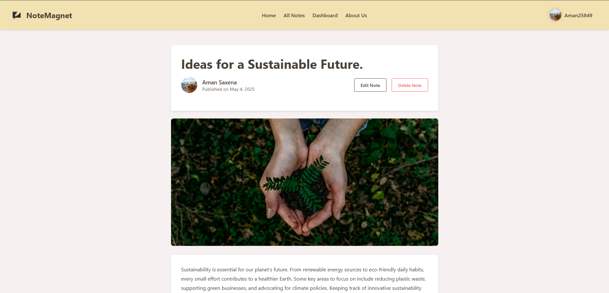

<p float="left">
  
  
</p>

# NoteMagnet

 A scalable note-sharing platform that empowers users to create, publish and share rich, visually
appealing notes with the public.

## Overview

NoteMagnet is a collaborative study platform where users can create, share, and discover high-quality notes. It features user profiles, tagging, bookmarks, views tracking, and a follower system to help learners stay organized and connected. Built with Django, Redis, and modern web technologies, NoteMagnet empowers users to learn smarter, together.

## Features

- **Collaborative Note Sharing**: Create and share well-structured notes with the community.

- **Authentication & Personalization**: Secure login system with django Allauth for personalized user settings.
  
- **User Profiles & Followers**: Connect with other learners through a follower/following system.

- **Bookmark & View Tracking**: Save favorite notes and monitor their popularity with view counters.

- **Advanced Search**: Quickly locate notes using keywords, tags, or author names.

- **Scalable Backend**: Built with Django, Redis, and Celery for performance and reliability.


## Installation

### Docker

```bash
# Install docker from this link according to your system.
https://www.docker.com/get-started/

# create a new folder and create 3 files:
1. Docker-compose.yaml
2. .env 
3. nginx.conf

#Copy code from these snippets into their appropriate files.
1. [Docker-compose.yaml](https://codefile.io/f/jlPjgj2tHg)
2. [.env](https://codefile.io/f/BMQFFZBOxX)
3. [nginx.conf](https://codefile.io/f/Cp2EREn7Aj)

# Run the images by this command.
docker-compose up -d

# Now open the browser and type this link.
http://localhost:80001/
```

### Full Local Installation

```bash
#(for windows users only) Install or enable WSL2 from window store
https://apps.microsoft.com/detail/9P9TQF7MRM4R?hl=en-us&gl=IN&ocid=pdpshare 

# Download and install PostgreSQL server for your system 
https://www.postgresql.org/download/

#make DataBase using psql in cmd
psql CREATE DATABASE NoteMagnet OWNER {your_name}

# Install redis
sudo apt-get install redis

#Leave wsl and in terminal install celery
pip install celery

# Clone the repository
git clone https://github.com/AmanSaxena25849/NoteMagnet.git

# Navigate to the project directory
cd Notemagnet

# Open .env file 
code .\Notemagnet\.env

# Add env variables in .env file.
DJANGO_SECRET_KEY= your_secret_key
DEBUG= True
POSTGRESQL_USER=your_postgreSQL_username
POSTGRESQL_PASSWORD=your_postgreSQL_password
GOOGLE_OAUTH_CLIENT_ID = your_google_oauth_clint_id
GOOGLE_OAUTH_SECRET = your_google_oauth_clint_secret
GITHUB_OAUTH_CLIENT_ID = your_github_oauth_clint_id
GITHUB_OAUTH_SECRET = your_github_oauth_clint_secret
TWITTER_OAUTH_CLIENT_ID = your_twitter_oauth_clint_id
TWITTER_OAUTH_SECRET = your_twitter_oauth_clint_secret

# Install dependencies
pip install -r requirements.txt

# Start redis server in wsl
sudo service redis-server start

# Start celery worker in seperate vscode terminal.
celery -A notemagnet worker --pool=solo --loglevel=info

#make migrations to the Database
python manage.py makemigrations
python manage.py migrate

# In other terminal run the application
python manage.py runserver

# Open browser and search
http://127.0.0.1:8000/
```

## Open project next time.
```bash
#Open wsl
wsl

#start redis server in wsl
sudo service redis-server start

#navigate to project directory in new terminal
cd (directory where you put the project)\notemagnet

# Start celery worker.
celery -A NoteMagnet worker --pool=solo --loglevel=info

# In other terminal vscode terminal eun the application
python manage.py runserver

#open browser and search
http://127.0.0.1:8000/
```


## Technologies

- Python 3.9+
- Django 5.2+
- AllAuth
- HTMX
- Redis
- Celery
- PostgreSQL


## Contact

**Aman saxena**
- Email: amansaxena25849@gmail.com
- Linkedin: https://www.linkedin.com/in/aman-saxena-949bb9322/
- Project Link: [https://github.com/AmanSaxena25849/NoteMagnet](https://github.com/AmanSaxena25849/NoteMagnet)


## Acknowledgments

- [FontAwesome](https://fontawesome.com/) for awesome fonts and icons.
- [Icon8](https://icons8.com/) for awesome icons.
- All contributors who have helped or will help build and improve AtmosphereAI.